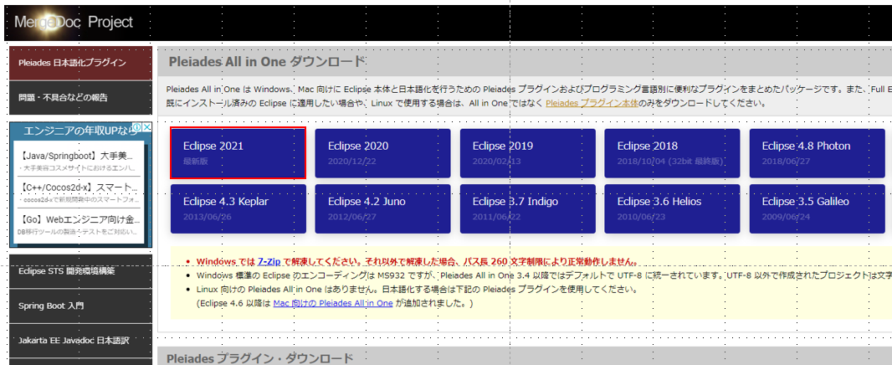

# 事前準備
Apiハンズオンに参加される前に、このドキュメントを参考に必要なアプリケーションのインストールなどの事前準備をしてください。

## エディタの準備
1. [こちら](https://mergedoc.osdn.jp/)よりEclipseをダウンロードし、インストールする。(自分の利用しているOSにあわせること)

 

## DBの準備
1. [こちら](https://www.enterprisedb.com/download-postgresql-binaries)より、PostgreSQLの`Version 10.16`をダウンロードし、インストールする。(自分の利用しているOSにあわせること)

2. インストール時に、パスワードとポート番号を設定する画面があるので、下記のように設定を行う。
   > パスワード : postgres  
   > ポート番号 : 5432

## アプリケーションの準備
1. [こちら](https://github.com/tomoyuki-nagata/apiHandsOn/tree/00_operation_check)よりコードをzipでダウンロードする。

2. ダウンロードしたzipファイルを解凍する。

## APIクライアントをインストール
1. Chromeにて[talend-api](https://chrome.google.com/webstore/detail/talend-api-tester-free-ed/aejoelaoggembcahagimdiliamlcdmfm?hl=ja)の拡張機能を追加する。