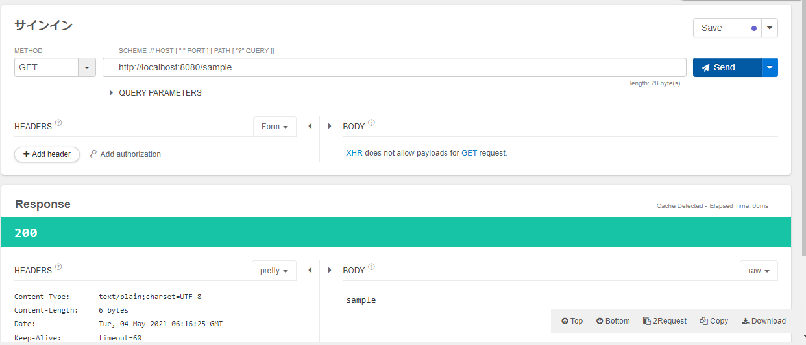

# 事前準備
Apiハンズオンで利用するサンプルプロジェクトが正常に動作するかの確認を行う。

## Eclipseを起動する
Eclipse.exeを起動する。 

## プロジェクトのインポート
ファイル > インポート > Maven > 既存のMavenプロジェクト > 次へ > ルートディレクトリで解凍したApiHandsOnのプロジェクトを参照 > 完了

## サーバーを起動する
ApiSampleのフォルダを右クリック > 実行 > Spring Bootアプリケーションを選択

## 動作確認
talend-apiにて`GET http://localhost:8080/sample`にアクセスし、下記のようになればOK
